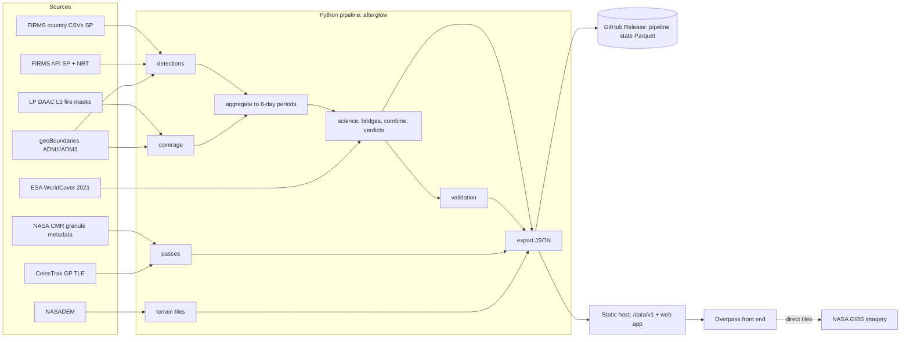

# Afterglow Backend: Design & Implementation Plan

> Backend for the **Overpass Control Room** front end ([design_alternative.md](design_alternative.md)) and its Grid precision mode ([design.md](design.md)).
> **Real data end to end. No mock values anywhere.** Every number the UI shows is traced to a NASA (or named open) source with a version and access date.
> Science basis: [docs/afterglow-plan.html](docs/afterglow-plan.html). Sources verified live on **7 Oct 2026** (see §2).

---

## 0. Architecture decision (one paragraph)

The backend is a **Python data pipeline that publishes a static, versioned JSON data API**. Scheduled GitHub Actions jobs refresh it. It is **not an always-on server**.

- Everything the front end needs can be precomputed per region, period and unit.
- The only "live" features (near-real-time hotspots, next satellite pass) refresh every 3 hours as files.
- Result: nothing can crash during judging, hosting is free (static), the demo works offline from a laptop, and anyone can reproduce the numbers.

If a future feature truly needs per-request computation (e.g. custom drawn polygons), add a FastAPI service that reads the same Parquet state. That is not needed for anything in the current designs.



---

## 1. Scope

| Item | Value |
|---|---|
| Primary region | **Bangladesh** (64 districts = geoBoundaries ADM2; 8 divisions = ADM1) plus a country-level aggregate |
| Validation regions | **Punjab, India** (ADM2 districts inside the Punjab ADM1) and **Paraná Delta, Argentina** (ADM2 departments listed in `regions.yaml`) |
| Years | 2001–present (Terra data from 2 Nov 2000; Aqua from Jul 2002; default baseline 2003–2022) |
| Satellites | `T` Terra MODIS · `A` Aqua MODIS (reference scale) · `N` Suomi NPP VIIRS · `J1` NOAA-20 VIIRS · `J2` NOAA-21 VIIRS |
| Time unit | 8-day period, 46 per year, aligned to 1 Jan (period 46 = day of year 361–365/366) |
| Space unit | Admin unit (district) polygons; the country is a unit too |
| Refresh | NRT every 3 h; L3 coverage and passes daily; science-quality (SP) promotion monthly |

---

## 2. Data sources (verified 7 Oct 2026)

| ID | Source | What we take | Access / auth | Verified facts | License / citation |
|---|---|---|---|---|---|
| `firms_country` | FIRMS Country Yearly Summary (SP) `https://firms.modaps.eosdis.nasa.gov/data/country/{modis\|viirs-snpp\|viirs-jpss1}/{YYYY}/{prefix}_{YYYY}_{Country}.csv` | MODIS C6.1, S-NPP and NOAA-20 SP detections with `type` | Public, **no key** | Bangladesh 2024: MODIS 1,876 rows, S-NPP 8,083, NOAA-20 8,048. Coverage: MODIS from 2000-11-02; S-NPP from 2012-01-20; NOAA-20 from 2018-04-01. **2025 and 2026 not yet published; no NOAA-21 files.** | NASA open data; cite FIRMS/LANCE (DOIs per product) |
| `firms_api` | FIRMS Area API `/api/area/csv/{MAP_KEY}/{SOURCE}/{W,S,E,N}/{1..5}/{YYYY-MM-DD}` | SP for recent months (`MODIS_SP`, `VIIRS_SNPP_SP`, `VIIRS_NOAA20_SP`); NRT (`MODIS_NRT`, `VIIRS_SNPP_NRT`, `VIIRS_NOAA20_NRT`, `VIIRS_NOAA21_NRT`) | Free MAP_KEY (secret); 5,000 transactions / 10 min | Day range 1–5 per call; `/api/data_availability/` lists date ranges per source | Same |
| `firms_umd` | UMD SFTP `fuoco.geog.umd.edu` (public login in VIIRS C2 user guide) `data/VIIRS/C2/VJ214IMGML`, MCD14ML | **Fallback** for NOAA-21 SP and any SP gaps | Public login | Monthly global CSV, Type field fixed in v3 (May 2025) | Same |
| `l3_masks` | LP DAAC: `MOD14A1.061`, `MYD14A1.061` (8 days per file, HDF4, ~0.7–1.0 MB); `VNP14A1.002`, `VJ114A1.002`, `VJ214A1.002` (daily, HDF5, ~0.16–0.25 MB) | Daily **FireMask** (cloud / land / fire / missing) + QA land/water | Earthdata Login token (secret); search via CMR, download with `earthaccess` | Bangladesh tiles **h25v06 + h26v06**. VJ114A1 ~1-day latency; VJ214A1 for Mar 2025 was processed 21 Nov 2025 (long lag possible). | NASA open data |
| `cmr_passes` | NASA CMR granule search `https://cmr.earthdata.nasa.gov/search/granules.json` for L2 `MOD14 061`, `MYD14 061`, `VNP14IMG 002`, `VJ114IMG 002`, `VJ214IMG 002` | **Real overpass times**, day/night flag, swath polygons | Public, no auth | 2025-03-06 over Bangladesh: Terra 2 granules (14:30, 14:35 UTC), Aqua 3 (08:10, 08:15, 20:20), S-NPP 5, NOAA-20 5, NOAA-21 2 | NASA metadata |
| `boundaries` | geoBoundaries API `https://www.geoboundaries.org/api/current/gbOpen/{ISO3}/ADM{1,2}/` | District and division polygons | Public | BGD ADM2: 64 units, source BBS/OCHA ROAP, built Dec 2023 | **CC BY 3.0 IGO** (BGD); check per country |
| `landcover` | ESA WorldCover 2021 v200 COGs `https://esa-worldcover.s3.eu-central-1.amazonaws.com/v200/2021/map/ESA_WorldCover_10m_2021_v200_{N21E090}_Map.tif` | Land-cover class fractions per unit (bridge strata) | Public HTTP range reads (206 verified) | 3°×3° tiles | **CC BY 4.0**, cite ESA WorldCover |
| `dem` | LP DAAC `NASADEM_HGT.001` | Terrain for 3D scene | Earthdata token | Bangladesh bbox: **38 tiles, 252 MB** | NASA open data |
| `tle` | CelesTrak GP `https://celestrak.org/NORAD/elements/gp.php?CATNR={id}&FORMAT=TLE` | Orbital elements for "Next look" | Public; fetch ≤ once per 6 h | IDs verified: Terra 25994, Aqua 27424, Suomi NPP 37849, NOAA 20 43013, NOAA 21 54234 | Public data; credit CelesTrak |
| `gibs` | NASA GIBS WMTS EPSG:3857 `…/wmts/epsg3857/best/{Layer}/default/{date}/GoogleMapsCompatible_Level9/{z}/{y}/{x}.jpg` | "See the ground" imagery | **Front end loads directly** (CORS `*` verified) | `VIIRS_NOAA20_CorrectedReflectance_TrueColor`, `MODIS_Aqua_CorrectedReflectance_TrueColor`, `BlueMarble_ShadedRelief_Bathymetry` all return 200 | NASA open; credit GIBS |

**Backfill volume for Bangladesh (2001–2026):**
- **MODIS L3:** 2 satellites × 2 tiles × 46 files/yr × ~24 yr ≈ 4,400 files ≈ **3.8 GB**.
- **VIIRS L3:** S-NPP ~11,000 + NOAA-20 ~6,600 + NOAA-21 ~2,200 daily files ≈ **4 GB**.
- **NASADEM:** 0.25 GB.
- **Detections:** < 50 MB.

Only aggregates are kept; raw files are cached locally during backfill and discarded afterwards.

---

## 3. Repository layout

```
afterglow/
├── pipeline/
│   ├── pyproject.toml          # uv-managed; Python 3.12
│   ├── regions.yaml            # region config (bbox, tz, ISO3, unit filters)
│   ├── schemas/                # JSON Schemas for every published file (v1)
│   ├── afterglow/
│   │   ├── config.py           # constants: sensors, periods, SIN grid, thresholds
│   │   ├── sources.py          # FIRMS, LP DAAC/earthaccess, CMR, geoBoundaries, WorldCover, CelesTrak, UMD SFTP
│   │   ├── detections.py       # normalize, confidence, dedupe, static mask, unit assignment
│   │   ├── coverage.py         # SIN pixel→unit index, FireMask decode, daily counts
│   │   ├── passes.py           # CMR granules → passes; TLE → next passes
│   │   ├── science.py          # period aggregation, bridges, chains, combine, verdicts, annual
│   │   ├── validate.py         # held-out evaluation → validation.json
│   │   ├── export.py           # JSON writers, schema validation, sanity gates
│   │   ├── terrain.py          # NASADEM → terrarium PNG tiles
│   │   └── cli.py              # `afterglow <stage> --region BGD --years 2001-2026`
│   └── tests/                  # pytest + small real sample granules + golden fixtures
├── web/                        # front end (reads /data/v1)
│   └── public/data/v1/         # generated, git-ignored, deployed with the site
├── .github/workflows/          # ci.yml, nrt.yml, daily.yml, monthly.yml, backfill.yml
├── DATA_LICENSES.md
└── justfile                    # one-line entry points (§14)
```

**Dependencies (all open source):**

| Package | Use |
|---|---|
| numpy, pandas, pyarrow | Arrays, tables, Parquet |
| scipy | `stats.norm`, interpolation |
| statsmodels | Negative-binomial GLM |
| shapely ≥ 2 | Vectorized point-in-polygon, STRtree |
| h5py | VIIRS L3 |
| pyhdf | MODIS L3 HDF4 (conda-forge on Windows if the wheel fails) |
| rasterio | NASADEM `.hgt`, WorldCover COG windows |
| Pillow | Terrain PNGs |
| earthaccess | Earthdata login, search, download |
| httpx | HTTP clients |
| sgp4 | Orbit propagation |
| paramiko | UMD SFTP fallback only |
| jsonschema | Export validation |
| pytest | Tests |

No GIS server, no database server.

---

## 4. Shared conventions

| Convention | Rule |
|---|---|
| Time | Stored in **UTC**. Region `tz` (e.g. `Asia/Dhaka`) is used only for display strings the front end builds. |
| Period index | `p = min(46, (doy - 1) // 8 + 1)`; `days_in_period = 8`, except p46 = 5 (or 6 in leap years). |
| Sensor IDs | `T, A, N, J1, J2` (fixed order everywhere; array index 0–4). |
| Unit IDs | `{ISO3}-{ADMx}-{shapeID}` from geoBoundaries; country unit = `{ISO3}`. Human names in `meta.json`. |
| Area | MODIS/VIIRS L3 SIN pixel = 926.625433 m → **0.858634 km²** (equal-area grid, constant). |
| Rate unit | **Detections per 1,000 clear-view km²-days**, expressed on the **Aqua MODIS** scale ("Aqua-eq."). |
| Internal format | Parquet, partitioned `region=/sensor=/year=`. |
| Published format | JSON (columnar arrays, numbers rounded: rates 3 significant figures, log values 3 decimals); gzip/brotli by the host. |
| Versioning | Path prefix `/data/v1/`. Every file carries `"schema": "afterglow/<kind>@1"`. Breaking changes → `/v2/`. |
| Nulls | `null` = no data (satellite not operating, or file missing). It never means zero. |

---

## 5. Pipeline stages

Each stage is **idempotent and incremental**. An `ingest_log.parquet` keyed by `(stage, region, sensor, date|file_id)` records what's done, so re-runs only fetch what's new.

### S1 · Boundaries → `units.parquet`, `geo/{region}.geojson`

1. Fetch ADM1 and ADM2 for each region from the geoBoundaries API (use `simplifiedGeometryGeoJSON`).
2. Filter units per `regions.yaml` (e.g. Punjab districts = ADM2 whose centroid falls in the Punjab ADM1 polygon).
3. Assign each ADM2 to its ADM1 (largest overlap) → breadcrumb `Bangladesh › Chattogram › Rangamati`.
4. Compute area (km², equal-area projection via shapely + EPSG:6933 formula or pyproj), centroid, bbox.
5. Export simplified geometry (shapely `simplify(0.002)`, 4-decimal coordinates) for MapLibre. Target ≤ 250 KB per region.
6. Country unit = union of ADM2.

### S2 · Land cover → `landcover.parquet`

For each unit, read the WorldCover COG at a decimated overview (~160 m) within the unit bbox and mask by polygon. Compute class fractions.

**Stratum** = majority group of `forest` (10), `cropland` (40) or `other` (20 shrub, 30 grass, 50 built, 60 bare, 90 wetland, 95 mangrove, …). Stored with the fractions so they can be shown in "Area facts".

### S3 · Detections → `detections.parquet`

**Fetch:**
- **SP history:** FIRMS country CSVs per year (MODIS, S-NPP, NOAA-20) for the region's country.
- **SP for months not yet in country files:** FIRMS API `*_SP` in 5-day windows over the region bbox.
- **NOAA-21:** check `/api/data_availability/` at runtime. Use `VIIRS_NOAA21_SP` if it exists; otherwise UMD `VJ214IMGML` monthly files; otherwise `VIIRS_NOAA21_NRT` history.
- **NRT:** last 5 days, every 3 h (§9).

**Normalize to one schema:**

```
sensor (T|A|N|J1|J2) · t_utc (timestamp) · lat · lon · frp (MW) · conf_raw · conf_class (0 low,1 nominal,2 high)
daynight (D|N) · type (0..3 | null for NRT) · scan · track · version · source (SP|NRT) · unit_idx · region
```

| Rule | Implementation |
|---|---|
| Satellite mapping | MODIS `satellite` = Terra/Aqua → T/A; VIIRS `N` → N, `N20` → J1, `N21` → J2 |
| Confidence | MODIS: `<30` → low, `30–79` → nominal, `≥80` → high (FIRMS guidance). VIIRS: `l/n/h`. **Low confidence is excluded from D but counted** (`excl_lowconf`). |
| Type | Keep `type == 0`. `type ∈ {1,2,3}` → `excl_static`. NRT rows (type null) get the static mask below. |
| VIIRS duplicates | Same sensor and same `t_utc` minute; centres closer than 200 m → keep max FRP. Implemented with a 0.002° grid hash plus a neighbour check, O(n). |
| Static mask (learned) | On a 400 m grid (0.0036°): a cell is static if it has ≥ 5 detections on ≥ 5 distinct days, spanning ≥ 3 calendar months in a year, in **≥ 2 different years**. Built from SP training years only. Kilns and industry fit this rule; one-off jhum and crop burns don't. Thresholds live in `config.py`; 20 random flagged cells are spot-checked in Worldview and logged. |
| Unit assignment | `shapely.STRtree(units).query(points, predicate="within")` → `unit_idx`; points outside the region are dropped. |
| Promotion | When SP arrives for a date, NRT rows for that date and sensor are **replaced**, not merged. |

### S4 · Coverage → `coverage_daily.parquet`

**One-time per tile: pixel → unit index (cached `.npy`).**

```python
R, T, NPX = 6371007.181, 1111950.5197665233, 1200          # MODIS SIN sphere, tile size (m), pixels
PX = T / NPX                                                  # 926.625433 m
def tile_lonlat(h, v):
    j, i = np.meshgrid(np.arange(NPX), np.arange(NPX))        # j=col, i=row
    x = (h - 18) * T + (j + 0.5) * PX
    y = (9 - v) * T - (i + 0.5) * PX
    lat = y / R
    lon = x / (R * np.cos(lat))
    return np.degrees(lon), np.degrees(lat)
unit_idx = np.full(NPX * NPX, -1, np.int16)
for k, poly in enumerate(units):                               # shapely 2, vectorized C loop
    inside = shapely.contains_xy(poly, lon.ravel(), lat.ravel())
    unit_idx[inside] = k
land = qa_land_mask(first_MOD14A1_file)                        # QA bits 0–1 == 0b10 (land); static
```

**Per daily FireMask layer (any satellite; all five share the same SIN grid):**

```python
fm = layer.ravel()                                            # uint8 classes
ok = (unit_idx >= 0) & land
clear  = np.bincount(unit_idx[ok & np.isin(fm, (5, 7, 8, 9))], minlength=U)
cloud  = np.bincount(unit_idx[ok & (fm == 4)],                minlength=U)
landpx = np.bincount(unit_idx[ok],                            minlength=U)
missing = landpx - clear - cloud                               # not processed / unknown / glint
```

| Detail | Rule |
|---|---|
| FireMask classes | MOD14A1 C6.1: 0–2 not processed, 3 water, 4 cloud, 5 non-fire land, 6 unknown, 7–9 fire low/nominal/high. **On first run, assert the VIIRS v002 class legend from the file attributes** and pin it in `config.py` (the test fails if it changes). |
| Max composite | The daily mask is the maximum class across that day's overpasses, so "clear" means **≥ 1 clear view that day**. This is the documented definition in the UI and on the Method page. |
| MOD14A1 | Each file packs up to 8 daily layers. Read the day-of-year list from file metadata and handle < 8 layers. |
| VIIRS v002 | One file per day (HDF5). Discover the `FireMask` dataset path once with `h5py.visititems` and pin it. |
| Download | `earthaccess.search_data(short_name, version, bounding_box, temporal)` → `earthaccess.download(..., local_path=cache)`; 8 parallel workers; retry with backoff; delete raw after counting (backfill keeps the cache until the stage completes). |

**Output row:** `region, sensor, date, unit_idx, land_px, clear_px, cloud_px, missing_px` (int32). Bangladesh ≈ 5 sensors × ~9,000 days × 65 units ≈ 2.9 M rows (~25 MB Parquet).

### S5 · Passes → `passes.parquet`

**Historical passes (real times):**
1. Query CMR per sensor's L2 product (`MOD14 061`, `MYD14 061`, `VNP14IMG 002`, `VJ114IMG 002`, `VJ214IMG 002`) per month over the region bbox (`page_size=2000`). Read `time_start`, `time_end`, `day_night_flag` and `polygons`.
2. Parse the polygons (lat/lon pairs) into shapely.
3. Group granules of the same sensor within ≤ 12 min into one **pass**. Pass time = midpoint of the earliest granule intersecting the region.
4. `units_bits` = bitset of units whose polygon intersects any granule of the pass.

**Output row:** `region, sensor, date, t_utc, night (bool), units_bits (hex)`. About 1,440 CMR requests for a full Bangladesh backfill (~12 min).

**Next passes (live):** see §9.

### S6 · Period aggregation → `periods.parquet`

For each `region × unit × sensor × year × period`:

| Column | Definition |
|---|---|
| `D` | vegetation detections kept (after filters) |
| `excl_static`, `excl_lowconf` | counts removed by each rule |
| `frp_sum`, `frp_p50` | FRP of kept detections |
| `day_share` | fraction of D that is daytime |
| `clear_km2d` | Σ days `clear_px × 0.858634` |
| `cloud_km2d`, `missing_km2d` | same for cloud and missing |
| `land_km2d` | `land_px × 0.858634 × days_in_period` |
| `cov` | `clear_km2d / land_km2d` (0–1) |
| `n_days` | days with a coverage record (`< days_in_period` → `partial` flag) |
| `n_passes` | passes of that sensor intersecting the unit in the period |
| `src` | `SP`, `NRT` or `MIX` |

The country unit aggregates by summing counts and areas across its districts.

### S7 · Science → `harmonized.parquet` (detail in §6)

### S8 · Validation → `validation.json` (detail in §7)

### S9 · Export → `/data/v1/**` (detail in §8)

### S10 · Terrain → `/data/v1/tiles/terrain/{z}/{x}/{y}.png`

1. Download NASADEM_HGT tiles covering the region bbox with `earthaccess` (Bangladesh: 38 tiles, 252 MB).
2. Mosaic with `rasterio.merge`.
3. For each Web-Mercator tile at **z 5–11** intersecting the bbox, compute pixel-centre lon/lat, sample the mosaic bilinearly (`scipy.ndimage.map_coordinates`) and fill voids/water with 0.
4. **Terrarium encoding**:

```python
v = h + 32768.0
R = np.floor(v / 256); G = np.floor(v) % 256; B = np.floor((v - np.floor(v)) * 256)
```

Write 256-px PNGs (~1,000–1,500 tiles, ~40 MB). MapLibre source: `{"type":"raster-dem","encoding":"terrarium","tiles":["/data/v1/tiles/terrain/{z}/{x}/{y}.png"],"tileSize":256,"maxzoom":11}`. Exaggeration 1.5 is set in the front end.

---

## 6. Science engine (S7) — exact formulas

The front end recomputes the **combination and verdict** live (stress test, baseline switch). Those two steps are specified exactly here and must give identical results in Python and TypeScript (golden test, §12).

### 6.1 Observation-aware rate

```
ρ_s = (D_s + 0.5) / (clear_km2d_s / 1000)          # per 1,000 clear km²-days; +0.5 continuity
valid_s  ⇔  cov_s ≥ 0.30  AND  land_km2d ≥ 100
```

### 6.2 Bridges (one per pair, fitted only on training years)

| Bridge | Training years | Why |
|---|---|---|
| `T → A` | 2003–2018 | Same algorithm, different time of day (also the method **control**) |
| `N → A` | 2012–2018 | Main VIIRS→MODIS bridge, before Aqua's drift grows |
| `J1 → N` | 2018-04 – 2022 | VIIRS→VIIRS, ~50 min apart |
| `J2 → J1` | 2024 | Only overlap available. **NOAA-21 results for 2024 are not "held out";** J2 is evaluated on 2025–2026 only. |

**Model** (statsmodels; one fit per bridge × stratum × day/night part):

```
D_ref ~ NegBin2(μ, α)
log μ = log(clear_km2d_ref/1000) + β0[k] + β1[k]·log ρ_s + β2·sin(2πp/46) + β3·cos(2πp/46)
k = stratum (forest | cropland | other) × region
```

- Rows: unit-periods where **both** sensors are valid.
- Day and night parts: D is split by `daynight` and both use the same exposure. The parts are fitted separately and their predicted rates summed.
- α is estimated with `sm.NegativeBinomial` first, then the GLM is fitted with that α.
- **Fallback ladder:** if a stratum has < 150 rows or does not converge → pool across strata in the region → pool across regions → ratio of sums `Σ D_ref / Σ D_s · Σ clear_s / Σ clear_ref` with bootstrap. The fallback level used is recorded per bridge in `meta.json`.

**Uncertainty:** year-block bootstrap (resample training years with replacement), **B = 200** refits per bridge; keep `(β, α)` per draw.

**Prediction for unit-period with sensor s** (draws b = 1..B, chained through the bridge path to A; same draw index b on every link):

```
x_b      = log ρ_s
for link in path(s → A):            # e.g. J1→N, N→A
    rate_b = exp(β0_b + β1_b·x_b + season_b)
    count_b ~ NegBin(mean = rate_b · clear_km2d_s/1000, α_b)     # predictive noise at s's own exposure
    x_b    = log((count_b + 0.5) / (clear_km2d_s/1000))
μ_s = mean_b(x_b) ,  σ_s = sd_b(x_b)
```

**Aqua itself:** `μ_A = log ρ_A`, `σ_A² = 1/(D_A + 0.5) + α_A` (delta method; α_A is from the N→A fit).

Invalid sensor-periods (`cov < 0.30`) get `μ_s = σ_s = null`.

### 6.3 Combination (shared formula — front end implements identically)

```
S = {s enabled and μ_s ≠ null}
if S = ∅:                       verdict = NOT_OBSERVED
w_s = 1/σ_s²
μ = Σ w_s μ_s / Σ w_s
σ² = (1/Σ w_s) · (1 + (|S| − 1)·r)          # r = inter-sensor error correlation (meta.combine.r)
H = exp(μ)    lo80/hi80 = exp(μ ∓ 1.2816σ)    lo95/hi95 = exp(μ ∓ 1.96σ)
```

`r` is **calibrated on training years**: the smallest r in {0, 0.1, …, 0.9} that gives ≥ 80% empirical coverage of the 80% interval for the held-out Aqua value within training data. It is published in `meta.json`.

### 6.4 Baselines and verdicts (shared formula)

**Baseline** for unit u, period p, baseline window W (default 2003–2022):

```
B = { H[u, y', p'] : y' ∈ W, y' ≠ y, p' ∈ {p−1, p, p+1} (wrapping across years), verdict ≠ NOT_OBSERVED }
if |B| < 20:   verdict = INSUFFICIENT_BASELINE
q10, q50, q90 = percentile(B, [10, 50, 90])  (linear);  max = max(B)
```

Published baselines are for target years **outside** W (one per unit-period). For years inside W, the pipeline computes verdicts with the target year excluded, as defined.

**Verdict:**

```
P_hi = 1 − Φ((ln q90 − μ)/σ)        P_lo = Φ((ln q10 − μ)/σ)
RECORD          if lo80 > max
UNUSUALLY_HIGH  if P_hi ≥ 0.90
POSSIBLY_HIGH   if P_hi ≥ 0.60
UNUSUALLY_LOW   if P_lo ≥ 0.90 and q10 ≥ q_min      # low verdicts only where normal activity is meaningful
POSSIBLY_LOW    if P_lo ≥ 0.60 and q10 ≥ q_min
TYPICAL         otherwise
```

`q_min` = 0.5 detections per 1,000 km²-days (config).

**Verdict codes** (JSON): `-1 no_data · 0 not_observed · 1 unusually_low · 2 possibly_low · 3 typical · 4 possibly_high · 5 unusually_high · 6 record · 7 insufficient_baseline · 8 pending_coverage`.

**Raw (naive) verdict, used by the Raw lens and the stress test:**

```
raw_total = Σ_{s ∈ S_enabled} D_s
raw baseline = q10/q90 of raw_total from baseline years (all sensors as they were)
class by point value vs q10/q90, with no uncertainty
```

### 6.5 Annual totals and ranks

```
total[u,y] = Σ_p H[u,y,p] · land_km2d[u,y,p] / 1000    (Aqua-eq. detections; excludes NOT_OBSERVED periods)
complete[u,y] = share of the year's land_km2d that was judged
```

The interval comes from summing bootstrap draws. `rank` is among years with `complete ≥ 0.8`, descending.

### 6.6 Flags (bitmask)

`1 provisional (NRT detections)` · `2 held_out (2023–2026)` · `4 used_for_calibration` · `8 partial_period (n_days < days)` · `16 coverage_pending`.

---

## 7. Validation (S8) → `validation.json`

Uses **exactly** the published bridges (trained on training years) and the shared combine/verdict code.

| Test | Construction | Metric |
|---|---|---|
| **H1 continuity** | Held-out 2023–2026 unit-periods where Aqua is valid. Reference = Aqua-only verdict (μ_A, σ_A vs baseline). Candidates: (ours) NOAA-20-only via the bridges; (a) raw NOAA-20 vs raw MODIS-era baseline; (b) one constant ratio; (c) per-region-month ratio without coverage; (d) NOAA-20-only baseline 2018-04–2022. | Cohen's κ (3-class: low / typical / high), year-block bootstrap 95% CI (B = 1,000) |
| Interval calibration | Same rows: share of Aqua-observed log-rates inside the 80% and 95% intervals | coverage80, coverage95 |
| Step change | 2012–2018: `log H(T,A,N) − log H(T,A)` vs `log raw(T,A,N) − log raw(T,A)` per unit-period | mean + 95% CI (ours should include 0) |
| Cloud artifact | Low-fire periods: Spearman ρ between the anomaly z = (μ − ln q50)/σ and `cov` (combined) | ρ ours vs ρ raw |
| Terra control | `T → A` on 2019–2022 | κ, coverage80 |
| Stress test cross-check | Per unit, the share of held-out periods whose class is unchanged when T, A and N are disabled (the exact front-end computation) | `verdicts_kept.{raw,adj}` per unit and region |

The **κ is computed in 10 lines of numpy** (no scikit-learn). The output includes `n`, train/test years, config hash and the commit. The Method page renders these numbers directly; none are typed by hand.

---

## 8. Static data API (`/data/v1/`)

All paths are relative to the site origin. Everything is JSON unless stated.

| Path | Purpose (front-end consumer) | Size target (gz) | Cache |
|---|---|---|---|
| `meta.json` | Fleet, periods, model parameters, regions + units list, freshness | ≤ 25 KB | 5 min |
| `geo/{region}.geojson` | District floor plates, outlines, picking | ≤ 120 KB | 1 day |
| `snapshots/{region}/{year}.json` | Everything the **Sky view** needs for one year, all units × 46 periods: columns, clouds, hot list, verdict sentence, pass-board per-sensor estimates, stress test | ≤ 150 KB | current year 5 min, past years 1 day |
| `series/{unit}.json` | Everything the **Grid / Time Ridge / Fire Rings** need for one unit across all years | ≤ 120 KB | 5 min |
| `detections/{region}/{year}/{pp}.json` | Sparks for one period (also daily counts for the pass board) | ≤ 60 KB typical | current year 5 min |
| `daily/{region}/{year}.json` | Per-day per-sensor seen % per unit + passes (pass board, sky rail, beam timing) | ≤ 150 KB | current year 5 min |
| `nrt/{region}.json` | Latest 10 days of NRT detections + next passes (24 h) + provisional periods | ≤ 80 KB | 5 min |
| `validation.json` | Method page charts, stress-test reference | ≤ 20 KB | 1 day |
| `provenance.json` | Data, versions, licenses, citations, access dates, code commit | ≤ 15 KB | 1 day |
| `health.json` | Last job runs and status (for the freshness chip) | ≤ 2 KB | no-cache |
| `tiles/terrain/{z}/{x}/{y}.png` | 3D terrain (terrarium) | ~30 KB per tile | 30 days |

### 8.1 `meta.json`

```ts
interface Meta {
  schema: "afterglow/meta@1"; generated_at: string; commit: string;
  periods: { count: 46; start_doy: number[] };                     // [1, 9, …, 361]
  sensors: Array<{ id: "T"|"A"|"N"|"J1"|"J2"; name: string; instrument: "MODIS"|"VIIRS";
                   data_start: string; planned_end: string|null; end_note: string|null }>;
  // e.g. T: data_start "2000-11-02", planned_end "2027-01", end_note "Data collection ends Jan 2027 (planned)"
  reference: "A";
  bridges: Array<{ from: string; to: string; train: [string, string]; fallback_level: 0|1|2|3 }>;
  combine: { min_cov: 0.30; r: number; z80: 1.2816; z95: 1.96 };
  verdict: { p_sure: 0.90; p_maybe: 0.60; q_min: number; min_baseline_n: 20; window: 1;
             codes: Record<string, number> };
  baselines: string[]; default_baseline: "2003-2022"; held_out: [2023, 2026];
  regions: Array<{ id: string; name: string; tz: string; bbox: [number,number,number,number];
                   centroid: [number, number]; years: [number, number];
                   data_through: { sp: string; nrt: string|null; l3: Record<string,string> };
                   units: Array<{ id: string; idx: number; name: string; adm1: string;
                                  area_km2: number; centroid: [number, number]; bbox: number[];
                                  stratum: "forest"|"cropland"|"other";
                                  landcover: Record<string, number> }> }>;
  sources: Array<{ id: string; last_success: string; ok: boolean }>;
}
```

### 8.2 `snapshots/{region}/{year}.json` (columnar; arrays indexed `[unit][period]`)

```ts
interface Snapshot {
  schema: "afterglow/snapshot@1"; region: string; year: number; units: string[];  // order = meta idx
  comb:  { mu: (number|null)[][]; sigma: (number|null)[][] };       // §6.3, full fleet
  verdict: number[][]; p_hi: (number|null)[][]; p_lo: (number|null)[][]; flags: number[][];
  cov:   (number|null)[][][];       // [sensor][unit][period] clear-view share 0–1
  cloud: (number|null)[][];         // [unit][period] combined cloud share (drives cloud slabs)
  raw:   (number|null)[][][];       // [sensor][unit][period] kept detections
  excl:  { static: number[][][]; lowconf: number[][][] };           // [sensor][unit][period]
  per:   { mu: (number|null)[][][]; sigma: (number|null)[][][] };   // [sensor][unit][period], Aqua-eq. log scale
  base:  { q10: number[][]; q50: number[][]; q90: number[][]; max: number[][]; n: number[][] };  // default baseline [unit][period]
  raw_base: { q10: number[][]; q90: number[][] };
  land_km2d: number[][]; clear_km2d: (number|null)[][][];            // for the conveyor band widths
  n_passes: number[][][];                                           // [sensor][unit][period]
}
```

The front end derives without extra requests:
- **column height** = `exp(comb.mu)`; solid/glass = `lo80` / `hi80`;
- **colour** = verdict;
- **cloud slab** if every enabled sensor has `cov < 0.30`;
- **hot list** = sort by `p_hi` (excluding codes 0, 7, 8);
- **stress test** = recombine `per.*` with sensors disabled, using §6.3–6.4 and `base`.

### 8.3 `series/{unit}.json` (flat arrays of length `Y·46`, index `(year − y0)·46 + (p − 1)`)

```ts
interface Series {
  schema: "afterglow/series@1"; unit: string; y0: number; y1: number;
  raw: Record<Sensor, (number|null)[]>; cov: Record<Sensor, (number|null)[]>;
  per_mu: Record<Sensor, (number|null)[]>; per_sigma: Record<Sensor, (number|null)[]>;
  comb_mu: (number|null)[]; comb_sigma: (number|null)[];
  verdict: number[]; p_hi: (number|null)[]; p_lo: (number|null)[]; flags: number[];
  excl_static: Record<Sensor, number[]>; excl_lowconf: Record<Sensor, number[]>;
  land_km2d: number[];
  baseline: Record<string /* "2003-2022" | "2012-2022" */,
                   { q10: number[]; q50: number[]; q90: number[]; max: number[]; n: number[] }>;  // length 46
  raw_baseline: Record<string, { q10: number[]; q90: number[] }>;
  annual: { total: (number|null)[]; lo80: (number|null)[]; hi80: (number|null)[];
            rank: (number|null)[]; complete: number[] };            // length Y
  peak_window: { start_p: number; end_p: number } | null;           // baseline median > annual 75th pct
}
```

### 8.4 `detections/{region}/{year}/{pp}.json`

```ts
{ schema: "afterglow/detections@1", region, year, period,
  lon: number[], lat: number[], s: number[] /* sensor idx */, t: number[] /* unix minutes UTC */,
  frp: number[], c: number[] /* 0 low 1 nominal 2 high */, x: number[] /* 0 kept 1 static 2 lowconf */,
  u: number[] /* unit idx */, src: number[] /* 0 SP 1 NRT */ }
```

### 8.5 `daily/{region}/{year}.json`

```ts
{ schema: "afterglow/daily@1", region, year, days: number,
  seen: number[][][]   /* [sensor][dayIdx][unit] 0–100 int, −1 no record */,
  passes: Array<{ d: number /* day idx */, s: number, t: number /* minute of day UTC */,
                  n: 0|1 /* night */, u: string /* hex bitset of units */ }> }
```

### 8.6 `nrt/{region}.json`

```ts
{ schema: "afterglow/nrt@1", generated_at, data_through,
  detections: { /* same columnar shape as §8.4, last 10 days */ },
  next_passes: Array<{ s: number; t: string /* ISO UTC */; n: 0|1; u: string /* hex units */ }>,  // next 24 h
  provisional: Array<{ year: number; period: number }> }
```

### 8.7 `validation.json`, `provenance.json`, `health.json`

Shapes are listed in `schemas/`. `provenance.datasets[]` = `{ id, short_name, version, provider, url, license, citation, temporal, files, bytes, accessed }`.

---

## 9. Live path (every 3 hours)

1. **NRT detections:** FIRMS API `MODIS_NRT`, `VIIRS_NOAA20_NRT` and `VIIRS_NOAA21_NRT` for the region bbox, last 5 days. Add `VIIRS_SNPP_NRT` only while `meta.sensors.N.planned_end` is in the future and data still arrive. Normalize, apply the learned static mask, assign units, upsert by `(sensor, t_utc, lat, lon)`.
2. **Coverage for those days:** use L3 days already ingested by the daily job.
   - Coverage present → compute provisional μ/verdict (flag `provisional`).
   - Coverage missing → verdict `8 pending_coverage`, while still showing raw detections. **The UI never invents coverage.**
3. **Next passes:** fetch CelesTrak TLEs (cached; refetch only if older than 6 h).
   - With `sgp4`, propagate each satellite for the next 24 h at 30 s steps.
   - Sub-satellite point: TEME → Earth-fixed via GMST rotation, then a spherical latitude/longitude.
   - A unit is "in view" when the great-circle distance from the sub-satellite point to its centroid is ≤ half-swath − unit radius (VIIRS 1,530 km, MODIS 1,165 km).
   - Pass time = minimum distance; night = solar zenith > 85° at the centroid (NOAA solar position formula, ~15 lines).
   - Satellites past their planned data end are listed with status only, without a next pass.
4. Re-export `nrt/{region}.json`, the current year's `snapshots`, the touched `series`, `detections` for touched periods, and `health.json`; deploy.

---

## 10. Scheduled jobs (GitHub Actions)

| Workflow | Trigger | Steps | Runtime (Bangladesh) |
|---|---|---|---|
| `ci.yml` | push / PR | ruff + pytest (unit + golden + schema) · front-end type-check + vitest on the same golden fixtures | ~3 min |
| `nrt.yml` | `cron: "17 */3 * * *"` | restore state → §9 → export → validate gates → deploy | ~4 min |
| `daily.yml` | `cron: "40 2 * * *"` | restore → L3 masks for the last 21 days not yet ingested (all 5 products) → CMR passes for the last 21 days → recompute touched periods → export → gates → deploy | ~10 min |
| `monthly.yml` | `cron: "0 4 5 * *"` | restore → FIRMS SP (country CSV if newly published, else API `*_SP`) → promote SP over NRT → recompute affected years → **rerun validation** → export → gates → deploy | ~20 min |
| `backfill.yml` | `workflow_dispatch(region, years)` | full S1–S10 for a region (or run locally; §14) | 2–4 h (download-bound) |

| Concern | Approach |
|---|---|
| State | Pipeline Parquet tables live as assets of a GitHub Release named `pipeline-state`. Jobs run `gh release download` at start and `gh release upload --clobber` at end. They are public and reproducible. Raw granules are never stored. |
| Concurrency | `concurrency: { group: pipeline, cancel-in-progress: false }` so jobs never race on state. |
| Secrets | `FIRMS_MAP_KEY`, `EARTHDATA_TOKEN` as repository secrets. They are never written to files that get deployed. |
| Deploy | Build the web app with `public/data/v1` → GitHub Pages or Cloudflare Pages (`_headers` file sets the cache rules from §8). |
| Gates (fail → no deploy, last good data stays live) | JSON Schema valid; no NaN; `0 ≤ cov ≤ 1`; sum of per-sensor raw = raw_total; per-year SP detection totals equal the FIRMS country CSV row counts after identical filters; verdict codes in range; validation H1 metrics present. |
| Alerts | A failed workflow emails the repo owners. `health.json` and `meta.sources[].last_success` drive the UI freshness chip ("Live data hasn't updated for 26 hours"). |

---

## 11. Front-end contract (every UI element → real data)

| UI element (design_alternative.md) | Data | Fields |
|---|---|---|
| Area breadcrumb, district list | `meta.json` | `regions[].units[].{name, adm1, idx}` |
| Date selector, scrubber, fleet milestones | `meta.json` | `periods`, `sensors[].{data_start, planned_end, end_note}`, `regions[].data_through` |
| District floor plates | `geo/{region}.geojson` | `shapeID`, `idx` |
| Burning columns (height, solid / glass, colour) | snapshot | `comb.mu/sigma` → H, lo80, hi80; `verdict` |
| Cloud slabs + dashed columns | snapshot | `cov[sensor]` (all < 0.30) and `cloud` |
| Sparks / chimneys | `detections/…/{pp}.json` | `lon, lat, s, t, frp, x` |
| Sky rail satellites, beam timing | `daily/{region}/{year}.json` | `passes[] {d, s, t, n, u}` |
| Pass board: time, ground seen, detections | `daily` + `detections` | `passes`, `seen[s][day][u]`, count of `s` on that day |
| Pass board: Aqua-eq. and range per sensor | snapshot | `per.mu/sigma[s][u][p]` |
| Pass board: status lights | `meta.json` | `sensors[].planned_end/end_note`; "OFF — SIMULATED" is UI state |
| Next look | `nrt/{region}.json` | `next_passes` |
| Hot list + micro-strips | snapshot | `p_hi`, `verdict` (all units × 46) |
| Verdict sentence | snapshot or series + meta | `verdict`, `p_hi`, `cov`, baseline label |
| Ground the fleet + "verdicts kept" counter | snapshot (held-out years) + meta | `per.*`, `base`, `raw`, `raw_base`, `combine.r`; cross-check `validation.verdicts_kept` |
| Evidence Conveyor | snapshot + daily | `n_passes`, `land_km2d`, `clear_km2d`, `cloud`, `excl.static/lowconf`, `raw`, `per.*`, `comb`, `base.q50` |
| Grid calendar, lenses, annual margin, rank, season profile, peak window | `series/{unit}.json` | all fields |
| Baseline switch (2003–22 / 2012–22) | series | `baseline[...]` (verdicts recomputed client-side with §6.4) |
| Time Ridge, Fire Rings | series | `comb_mu`, `comb_sigma`, `verdict`, `cov` |
| See the ground / Worldview link | (none; front end builds URLs) | GIBS tile URL; Worldview `?v=W,S,E,N&t=YYYY-MM-DD&l=…` |
| CSV / evidence sheet | client-side from loaded JSON | — |
| Method page | `validation.json`, `provenance.json`, `meta.bridges/combine` | all |
| Freshness chip | `health.json`, `meta.sources` | `last_success`, `ok` |
| 3D terrain | `tiles/terrain` | terrarium PNG |

**Honesty label update:** pass times now come from NASA CMR granule records. The scene label becomes `Pass times from NASA CMR granule records · orbit paths illustrative · heights log-scaled`.

---

## 12. Testing

| Test | What it proves |
|---|---|
| `test_periods` | doy → period mapping, p46 length in leap and non-leap years |
| `test_sin_grid` | Pixel centres of a known tile corner match published MODIS tile bounds (±1 m) |
| `test_coverage_counts` | On a **real committed sample** (one MOD14A1 and one VNP14A1 granule for h26v06, ~1.2 MB total), `clear + cloud + missing = land` per unit, and the class legend matches the pinned config |
| `test_detections` | FIRMS row mapping (T/A/N/J1/J2), confidence classes, 200 m dedupe, static-mask rule on a synthetic kiln (daily, Nov–Apr, two years) vs a one-off burn |
| `test_bridge_recovers` | On synthetic data with a known ratio (rate_ref = 0.2·rate_s), the NB bridge recovers β within tolerance and the 80% intervals cover ~80% |
| **`golden/combine.json`** | 200 hand-built cases (μ_s, σ_s, enabled set, baseline) → expected μ, σ, P_hi, P_lo, verdict. **The same file runs in pytest and in the front end's vitest.** This guarantees the stress test in the browser equals `validation.json`. |
| `test_kappa` | Known confusion matrices → known κ |
| `test_export_schema` | Every exported file validates against `schemas/*.json` |
| `test_gates` | SP yearly totals = FIRMS country CSV rows after filters (Bangladesh 2024 fixture) |
| `test_terrarium` | Encode → decode round-trip error < 0.01 m |

Each non-trivial module has one focused test file. No heavy fixtures.

---

## 13. Performance and sizes

| Item | Expected |
|---|---|
| Backfill Bangladesh, download | ~8 GB; 1–3 h depending on LP DAAC throughput (8 workers) |
| Backfill processing | Coverage ~0.2 s per file → ~1 h single core (parallelizable); detections < 1 min; CMR passes ~12 min; bridges (B = 200) ~5–10 min; export < 1 min; terrain ~5 min |
| Incremental jobs | 4–20 min (§10) |
| Published data (Bangladesh, all years) | snapshots 26 × ~150 KB gz; series 65 × ~120 KB gz; detections ~1,200 small files; terrain ~40 MB. Total well under 1 GB (GitHub Pages limit). |
| Front-end first load | `meta` (25 KB) + current-year `snapshot` (150 KB) → pass board, hot list and verdict render before the 3D scene loads |

---

## 14. Local development

```bash
# one-time
uv sync --project pipeline
export FIRMS_MAP_KEY=…  EARTHDATA_TOKEN=…        # or ~/.netrc for Earthdata; never commit

# full backfill for Bangladesh (all stages), then serve with the web app
uv run --project pipeline afterglow backfill --region BGD --years 2001-2026
uv run --project pipeline afterglow terrain  --region BGD
uv run --project pipeline afterglow export   --region BGD --out web/public/data/v1
uv run --project pipeline pytest

# incremental (what the scheduled jobs call)
uv run --project pipeline afterglow nrt     --region BGD
uv run --project pipeline afterglow daily   --region BGD
uv run --project pipeline afterglow monthly --region BGD
```

The `justfile` wraps these (`just backfill BGD`, `just test`, `just serve`). **Windows note:** if `pyhdf` fails to build, install it from conda-forge or run the pipeline in WSL. CI runs on Ubuntu.

---

## 15. Security, licensing, provenance

- **Secrets:** only in GitHub secrets and local env/.netrc. The static site contains **no keys**. The front end calls only our own origin and NASA GIBS.
- **No user data:** no accounts, no analytics required. If analytics are wanted later, use cookieless, aggregate-only analytics.
- **Licenses:**
  - code under Apache-2.0;
  - NASA data cited per product;
  - geoBoundaries **CC BY 3.0 IGO** (BGD; per-country licenses recorded);
  - ESA WorldCover **CC BY 4.0**;
  - CelesTrak credited.
  `DATA_LICENSES.md` and `provenance.json` list each dataset with version and access date. This satisfies the Space Apps "cite every source" and open-license rules.
- **Branding:** the backend publishes no NASA insignia or marks. The footer credit line is in the front end.

---

## 16. Implementation order

Each step ends with something the front end can use.

| # | Work | Output usable by the front end | Est. |
|---|---|---|---|
| B1 | `config.py`, `regions.yaml`, period math + tests | — | 1 h |
| B2 | Boundaries (S1) + `geo/*.geojson` + units in `meta.json` | Map plates, area picker | 1.5 h |
| B3 | Detections (S3) from FIRMS country CSVs + filters + unit assignment | Sparks, raw counts | 3 h |
| B4 | Coverage (S4): SIN index, MOD14A1/VNP14A1/VJ114A1 decode, daily counts | Clouds, seen % | 4 h |
| B5 | Period aggregation (S6) + snapshot/series export with raw + coverage | Raw lens, Coverage lens, clouds | 2 h |
| B6 | Science (S7): bridges, chains, combine, verdicts, annual; golden fixture | Columns, verdicts, hot list, stress test | 5 h |
| B7 | Passes (S5) from CMR + `daily/*.json` | Pass board, sky rail | 2 h |
| B8 | Validation (S8) + `validation.json`, `provenance.json` | Method page, stress-test check | 3 h |
| B9 | Terrain (S10) | 3D terrain | 1.5 h |
| B10 | Live path (§9): NRT + TLE next passes + `nrt.json` | Next look, provisional periods | 2.5 h |
| B11 | Workflows, state release, gates, deploy (§10) | Auto-refreshing site | 2.5 h |
| B12 | Land cover (S2) strata + Punjab and Paraná Delta backfills | Validation across regions | 2 h |

≈ 30 engineer-hours. With two backend people, B1–B6 are the critical path. Start the Bangladesh L3 backfill download early (B4); it runs unattended.

---

## 17. Risks and fallbacks

| Risk | Fallback |
|---|---|
| LP DAAC download slow or throttled | Start the backfill first. Limit VIIRS L3 to the bridge and held-out years (2012–2026) if needed. MODIS CMG `CloudCorrFirePix` (UMD SFTP) is the coverage fallback for MODIS-only years. |
| `pyhdf` unavailable on Windows | conda-forge build, WSL or CI-only processing of MODIS L3 |
| NOAA-21 SP unavailable | UMD `VJ214IMGML` or `VIIRS_NOAA21_NRT` history; NOAA-21 is clearly flagged in provenance. J2 is excluded from H1 (it is already only evaluated on 2025–2026). |
| VJ214A1 processing lag (months) | NOAA-21 coverage → `pending_coverage` for recent periods; other sensors carry the verdict |
| Sparse strata, NB non-convergence | Fallback ladder (§6.2), recorded in `meta.bridges[].fallback_level` and shown on the Method page |
| S-NPP delivery ends 1 Nov 2026 | Sensor marked ended in `meta`; the NRT fetch for `N` stops automatically after its last data date |
| Terra or Aqua stop earlier than planned | Same mechanism. The fleet table is data, not code. |
| CMR polygon format variations | Fall back to the bounding box when polygons are absent; this is logged |
| FIRMS 2025 country files not yet published | API `*_SP` in 5-day windows (≈ 73 calls per sensor-year) within the transaction limit |

---

## 18. Items to confirm on first run (automated asserts, not guesses)

1. The VIIRS v002 L3 FireMask class legend and dataset path (assert + pin).
2. The MOD14A1 day-of-year metadata attribute name for partial files.
3. `/api/data_availability/` source names and ranges (especially `VIIRS_NOAA21_SP`).
4. FIRMS country file naming for India and Argentina (`{prefix}_{YYYY}_India.csv`, `…_Argentina.csv`).
5. That CMR granule `polygons` are present for all five L2 products.
6. Terra daytime passes over Bangladesh in 2025–2026. The 2025-03-06 sample showed only 14:30 UTC (night) granules. Report what the data say; don't assume.
